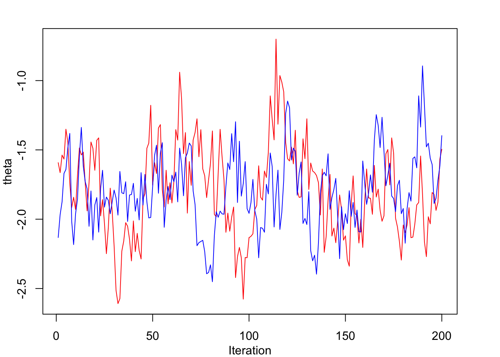
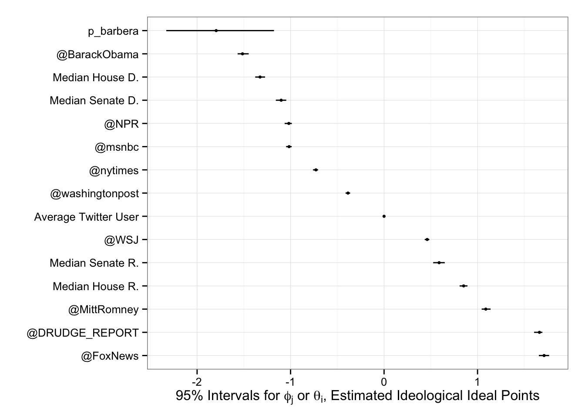

<!-- R syntax highlighter -->

Estimating Ideological Positions with Twitter Data
----------------

This GitHub repository contains code and materials related to the article "[Birds of a Feather Tweet Together. Bayesian Ideal Point Estimation Using Twitter Data](http://pan.oxfordjournals.org/content/23/1/76.full)," published in Political Analysis in 2015. 

The original replication code can be found in the `replication` folder. See also [Dataverse](https://dataverse.harvard.edu/dataset.xhtml?persistentId=doi:10.7910/DVN/26589) for the full replication materials, including data and output.

As an application of the method, in June 2015 I wrote a blog post on The Monkey Cage / Washington Post entitled ["Who is the most conservative Republican candidate for president?"](http://www.washingtonpost.com/blogs/monkey-cage/wp/2015/06/16/who-is-the-most-conservative-republican-candidate-for-president/). The replication code for the figure in the post is available in the `primary` folder.

Finally, this repository also contains an R package (`tweetscores`) with several functions to facilitate the application of this method to future research. The rest of this README file provides a tutorial of how to use it.

<h3>Authentication</h3>

In order to download data from Twitter’s API, the first step is to create an authentication token. In order to do so, it’s necessary to follow these steps:

1 - Go to apps.twitter.com and sign in 2 - Click on “Create New App” 3 - Fill name, description, and website (it can be anything, even google.com), and make sure you leave ‘Callback URL’ empty 4 - Agree to user conditions 5 - Copy consumer key and consumer secret and paste below

<pre class="r"><code>install.packages(&quot;ROAuth&quot;)
library(ROAuth)
requestURL &lt;- &quot;https://api.twitter.com/oauth/request_token&quot;
accessURL &lt;- &quot;https://api.twitter.com/oauth/access_token&quot;
authURL &lt;- &quot;https://api.twitter.com/oauth/authorize&quot;
consumerKey &lt;- &quot;XXXXXXXXXXXX&quot;
consumerSecret &lt;- &quot;YYYYYYYYYYYYYYYYYYY&quot;
my_oauth &lt;- OAuthFactory$new(consumerKey=consumerKey, consumerSecret=consumerSecret, 
    requestURL=requestURL, accessURL=accessURL, authURL=authURL)</code></pre>

6 - Run this line and go to the URL that appears on screen

<pre class="r"><code>my_oauth$handshake(cainfo = system.file(&quot;CurlSSL&quot;, &quot;cacert.pem&quot;, package = &quot;RCurl&quot;))</code></pre>

7 - Copy and paste the PIN number (6 digits) on the R console 8 - Change current folder into a folder where you will save all your tokens

<pre class="r"><code>setwd(&quot;~/Dropbox/credentials/twitter&quot;)</code></pre>

9 - Now you can save oauth token for use in future sessions with R

<pre class="r"><code>save(my_oauth, file=&quot;my_oauth&quot;)</code></pre>

<h3>Installing <code>tweetscores</code> package</h3>

We can now install the <code>tweetscores</code> package, as well as all other R packages necessary for the functions to run correctly.

<pre class="r"><code>toInstall &lt;- c(&quot;ggplot2&quot;, &quot;scales&quot;, &quot;R2WinBUGS&quot;, &quot;devtools&quot;, &quot;yaml&quot;, &quot;httr&quot;, &quot;jsonlite&quot;,
               &quot;rjson&quot;, &quot;RJSONIO&quot;)
install.packages(toInstall, repos = &quot;http://cran.r-project.org&quot;)
library(devtools)
install_github(&quot;pablobarbera/twitter_ideology/pkg/tweetscores&quot;)</code></pre>

<h3>Estimating the ideological positions of a US Twitter user</h3>

We can now go ahead and estimate ideology for any Twitter users in the US. In order to do so, the package includes pre-estimated ideology for political accounts and media outlets, so here we’re just replicating the second stage in the estimation – that is, estimating a user’s ideology based on the accounts they follow.

<pre class="r"><code># load package
library(tweetscores)</code></pre>
<pre class="r"><code># downloading friends of a user
user &lt;- &quot;p_barbera&quot;
friends &lt;- getFriends(screen_name=user, oauth_folder=&quot;~/Dropbox/credentials/twitter&quot;)</code></pre>
<pre><code>## /Users/pablobarbera/Dropbox/credentials/twitter/oauth_token_32 
## 15  API calls left
## 1065 friends. Next cursor:  0 
## 14  API calls left</code></pre>
<pre class="r"><code># estimate ideology with MCMC method
results &lt;- estimateIdeology(user, friends)</code></pre>
<pre><code>## p_barbera follows 11 elites: nytimes maddow caitlindewey carr2n fivethirtyeight NickKristof nytgraphics nytimesbits NYTimeskrugman nytlabs thecaucus</code></pre>
<pre><code>
## Chain 1
  |=================================================================| 100%
## Chain 2
  |=================================================================| 100%
</code></pre>

Once we have this set of estimates, we can analyze them with a series of built-in functions.

<pre class="r"><code># summarizing results
summary(results)</code></pre>
<pre><code>##        mean   sd  2.5%   25%   50%   75% 97.5% Rhat n.eff
## beta  -2.30 0.57 -3.37 -2.72 -2.25 -1.92 -1.26 1.02   200
## theta -1.78 0.30 -2.28 -1.99 -1.82 -1.59 -1.11 1.00   200</code></pre>
<pre class="r"><code># assessing chain convergence using a trace plot
tracePlot(results, &quot;theta&quot;)</code></pre>

<pre class="r"><code># comparing with other ideology estimates
plot(results)</code></pre>

<h3>Faster ideology estimation</h3>

The previous function relies on a metropolis-hastings sampling algorithm to estimate ideology. However, we can also use maximum likelihood estimation to compute the distribution of the latent parameters. This method is much faster, since it’s not sampling from the posterior distribution of the parameters, but it will tend to give smaller standard errors. However, overall the results should be almost identical.

<pre class="r"><code># faster estimation using maximum likelihood
results &lt;- estimateIdeology(user, friends, method=&quot;MLE&quot;)</code></pre>
<pre><code>## p_barbera follows 11 elites: nytimes maddow caitlindewey carr2n fivethirtyeight NickKristof nytgraphics nytimesbits NYTimeskrugman nytlabs thecaucus</code></pre>
<pre class="r"><code>summary(results)</code></pre>
<pre><code>##        mean   sd  2.5%   25%   50%   75% 97.5% Rhat n.eff
## beta  -2.30 0.57 -3.37 -2.72 -2.25 -1.92 -1.26 1.02   200
## theta -1.78 0.30 -2.28 -1.99 -1.82 -1.59 -1.11 1.00   200</code></pre>

<h3>Additional functions</h3>

The package also contains additional functions that I use in my research, and I’m providing here in case they are useful:

<ul>
<li><code>scrapeCongressData</code> is a scraper of the list of Twitter accounts for Members of the US congress from the <code>unitedstates</code> Github account.</li>
<li><code>getUsersBatch</code> scrapes user information for more than 100 Twitter users from Twitter’s REST API.</li>
<li><code>getFollower</code> scrapes followers lists from Twitter’ REST API.</li>
<li><code>CA</code> is a modified version of the <code>ca</code> function in the <code>ca</code> package (available on CRAN) that computes simple correspondence analysis with a much lower memory usage.</li>
<li><code>supplementaryColumns</code> and <code>supplementaryRows</code> takes additional columns of a follower matrix and projects them to the latent ideological space using the parameters of an already-fitted correspondence analysis model.</li>
<li><code>getCreated</code> returns the approximate date in which a Twitter account was created based on its Twitter ID. In combination with <code>estimatePastFollowers</code> and <code>estimateDateBreaks</code>, it can be used to infer past Twitter follower networks.</li>
</ul>

