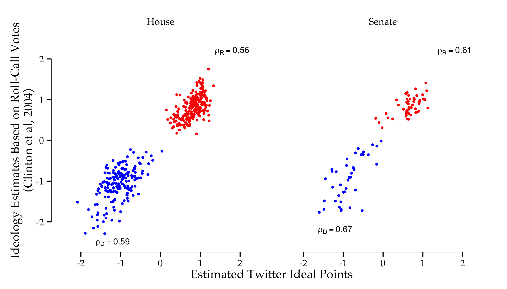

Replication materials: _Who is the most conservative Republican candidate for president?_
--------------

This github repository contains the replication code for the blog post ["Who is the most conservative Republican candidate for president?"](http://www.washingtonpost.com/blogs/monkey-cage/wp/2015/06/16/who-is-the-most-conservative-republican-candidate-for-president/), posted in The Monkey Cage / Washington Post on June 16, 2015. 

The method applied in this post is based on the article published in [Political Analysis](http://pan.oxfordjournals.org/content/23/1/76.full) earlier this year (see main page of this repository), although in order to deal with the larger dimensions of the adjacency matrix of followers I use correspondence analysis to scale political actors, and then project them on the same latent ideological space as Clinton et al's estimates for Members of Congress from roll-call votes. The resulting estimates are correlated at r=0.99 with the Bayesian model from the paper, at a much lower computational cost. The correlations for legislators' estimates between their Twitter scores and their ideal points based on roll-call votes are also higher, as shown below -- not surprising, since I'm projecting on the same space, but note that the purpose of this application is to compute the ideology of primary candidates.

In addition to all the code necessary to collect the data, run the model, and replicate the Figure on the blog post, I'm also providing three replication datasets (available on Amazon S3 for download):

- [`userlist-US.rdata'](https://s3.amazonaws.com/pablobarbera_data/static/userlist-US.rdata) contains the list of 13 million Twitter User IDs who are included in the estimation.
- [`adj-matrix-US.rdata'](https://s3.amazonaws.com/pablobarbera_data/static/adj-matrix-US.rdata) is the adjacency matrix of dimension 13 million users by 538 political accounts that I scale to recover the ideology estimates.
- [`ca-results-US.rdata'](https://s3.amazonaws.com/pablobarbera_data/static/ca-results-US.rdata) contains the results of estimating correspondence analysis with this matrix.

The repository also contains four additional datasets with the list of political accounts included in the analysis, their Twitter users profile information, and the legislator ideal points from roll-call votes estimated by Simon Jackman and downloaded from his website as of June 1st (provided here only to ensure exact replication of the results in the post, since he updates them with every roll call vote.)
