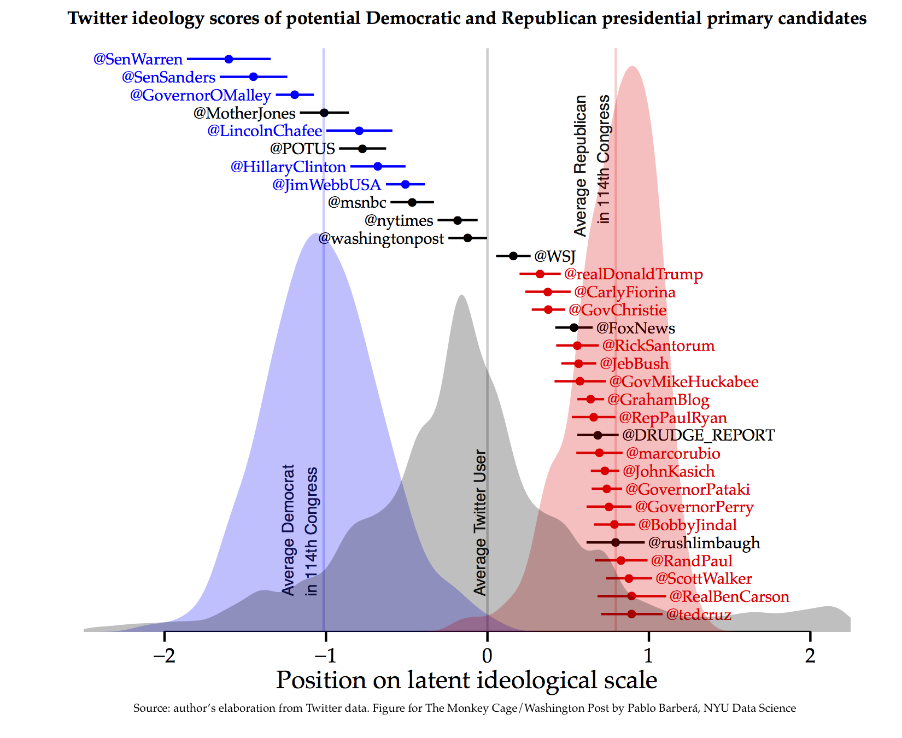

Who is the most conservative Republican candidate for president?
--------------

The Republican field is crowded, which implies that primary voters have little information about where some of the candidates stand. That is particularly the case this season, with a few relatively unknown contenders who <a href="http://votesmart.org/candidate/key-votes/120023/carly-fiorina/41">lack legislative experience</a> or a <a href="https://www.crowdpac.com/candidates/9999825/ben-carson#modal-money">long history of campaign contributions</a> that would allow researchers to precisely identify where they stand on the liberal-to-conservative political dimension.

However, one characteristic all candidates share is that they have active and popular Twitter accounts. And as I showed in an <a href="http://pan.oxfordjournals.org/content/23/1/76.full">article published earlier this year</a> in the journal Political Analysis -- now freely available online as an <a href="http://oxfordjournals.org/our_journals/polana/editorschoice.html">Editors' Choice article</a> -- it is possible to analyze the candidates' Twitter networks to compute precise ideological scores and thus identify how conservative or liberal each of them is.

The intuition behind this method is simple: Citizens prefer to follow on Twitter those political accounts that they perceive to be ideologically close to their own positions. Tea party supporters, for example, tend to follow Ted Cruz and Marco Rubio, but not Chris Christie. The same occurs on the other side of the spectrum: Elizabeth Warren and Bernie Sanders will have a more liberal set of followers than Hillary Clinton. Relying on this assumption, I developed a statistical model that estimates simultaneously the positions of political actors and voters. And since not only politicians but also media outlets, private companies, and interest groups are active on Twitter the resulting ideological scores are comparable for different sets of accounts.

The figure below displays the ideological scores of all declared and rumored major primary candidates as of June 1, estimated using their Twitter networks applying this method. To facilitate its interpretation, I have also indicated the location of a few major news outlets, as well as the distribution of ideological scores for all Twitter users (in black) and for Republican and Democratic members of Congress (in red and blue). The results are consistent with <a href="https://www.crowdpac.com/elections/2016-presidential-election">other existing ideology scores</a>, but they also yield some new and unexpected insights.

On the left, it shows the low viability of Sanders's campaign: Only around 5 percent of Twitter users hold more liberal positions than his. The same applies to Warren, which perhaps contributed to her decision not to run this season. Clinton still holds a centrist position in the Democratic Party, not significantly different from President Obama's, despite her efforts to win over progressive voters. Interestingly, former Republican senator Lincoln Chafee appears to be as liberal as Clinton; a finding that is not unexpected given his <a href="https://en.wikipedia.org/wiki/Political_positions_of_Lincoln_Chafee">current policy positions</a> and his endorsement of Barack Obama for president in 2008.

On the right, there's a virtual tie between Cruz, Ben Carson, Scott Walker and Rand Paul for the title of most conservative primary candidate. Similar to what <a href="http://fivethirtyeight.com/datalab/jeb-bush-president-republican-primary-2016/">others have pointed out</a>, Jeb Bush is to the Republican Party what Hillary Clinton is to the Democrats, with a stance close to the average Republican in Congress, similar to the ideological score for Fox News. One surprising result is Rick Santorum's moderate position within the Republican Party, which suggests he might be succeeding in portraying himself as a "<a href="http://www.regnery.com/books/blue-collar-conservatives/">blue-collar conservative</a>," with an increased focus on income inequality and working-class families. Finally, these results put Carly Fiorina and Christie far to the left of most Republicans, suggesting they will have to demonstrate their conservative credentials if they aspire to receive the nomination.

One distinctive feature of Twitter networks is that they are dynamic: Users can decide to follow and "unfollow" political accounts at any time. By observing how these networks change over time, it is thus possible to measure how politicians' perceived ideological positions evolve. It will be interesting to observe how these scores change over the next few months in response to campaign events, and in particular whether the candidates who receive the party nominations converge toward the center during the general election campaign, as the <a href="http://www.unc.edu/~bdlacree/doc/Acree_MA_Etch.pdf">post-primary moderation hypothesis suggests</a>.

This application illustrates the vast potential of <a href="http://www.annualreviews.org/eprint/KiHmqacYVWqAJvNvpPW4/full/10.1146/annurev-soc-071913-043145">digital footprints</a> as a useful source of information about social behavior and public opinion. While the act of following a political account on Twitter may appear irrelevant if considered individually, when millions of these decisions are aggregated the emerging patterns yield useful insights that can help voters make more informed political choices.

